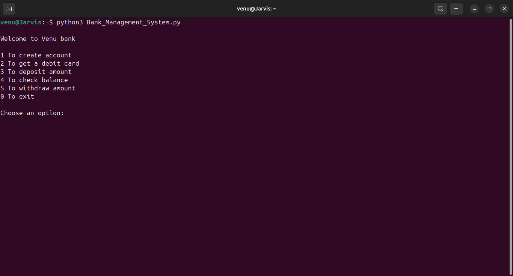
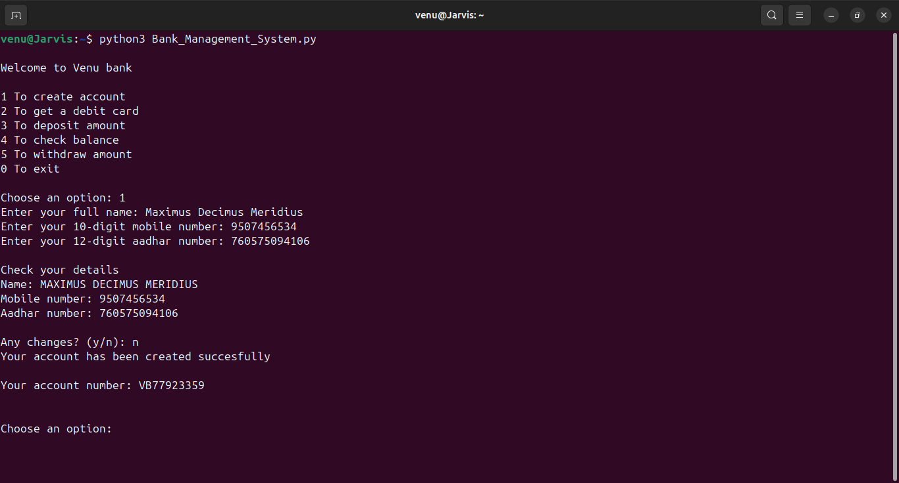
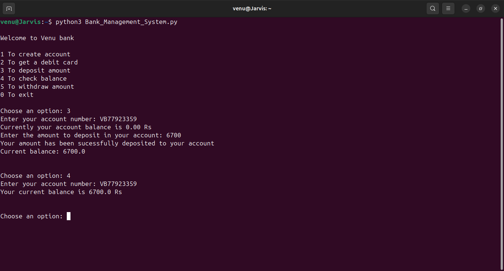

# 🏦 Bank Management System using Python

A **file-based Bank Management System** built with Python that simulates real-world banking operations without using a database. The system allows users to create accounts, generate debit cards, change PINs, deposit and withdraw money, and check balances — all through a simple command-line interface.

---

## 🚀 Features
- Account creation with **Aadhar & mobile number validation**
- Automatic **account number and debit card generation**
- **PIN change** functionality with security verification
- **Deposit, withdraw, and balance check** operations
- Data storage using **text files (file handling)** instead of a database
- Proper **input validation and exception handling**

---

## 🧠 Tech Stack
- **Language:** Python  
- **Modules Used:** `os`, `random`, `string`  
- **Concepts:** File Handling, Loops, Conditional Statements, Exception Handling

---

## 📸 Screenshots
| Menu | Account Creation | Balance Check |
|------|------------------|----------------|
|  |  |  |

---

## ⚙️ How to Run
1. Clone the repository  
   ```bash
   git clone https://github.com/yourusername/Bank-Management-System.git
   cd Bank-Management-System
# Bank-Management-System
A file-based banking system implemented in Python with account management, deposits, and balance enquiry features.
